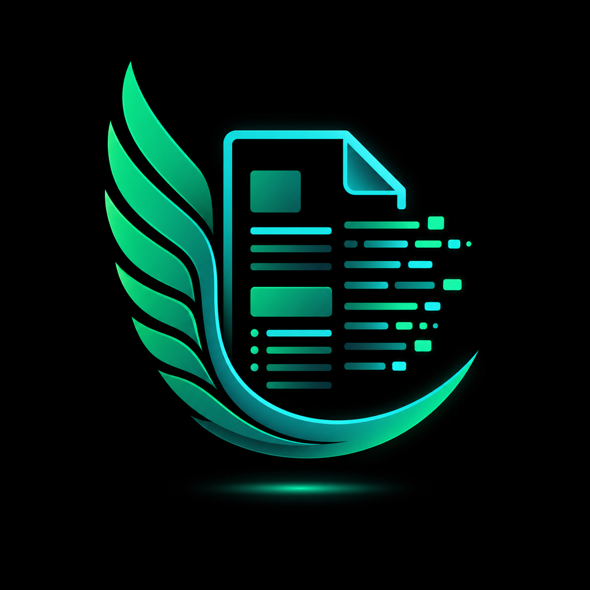

<p align="center">
  
</p>

<h1 align="center">Hermes Document Extract Plugin</h1>

<p align="center">
  Local document and image extraction for Hermes Agent: files → cached Markdown → agent-readable text.
</p>

<p align="center">
  <a href="LICENSE"></a>
  <a href="README.ru.md">Русский README</a>
</p>

> Built for [Hermes Agent](https://github.com/NousResearch/hermes-agent)'s native plugin system. Community plugin; not an official Nous Research / Hermes Agent plugin.

## Hermes Agent integration

Hermes Agent is an open-source, tool-using AI agent framework. This plugin adds document extraction as native Hermes tools, so the agent can call them automatically when a user asks to inspect a local PDF, Office document, spreadsheet, presentation, archive, or image.

It is installed with `hermes plugins install`, registers under the existing `file` toolset, and works in normal Hermes CLI/gateway sessions after a restart/reset.

## What it does

`hermes-plugin-document-extract` adds native Hermes tools that convert local documents and images into Markdown before the agent reads them.

```text
PDF / DOCX / image / folder
        ↓
document_extract
        ↓
~/.hermes/cache/document-extract/*.md
        ↓
Hermes reads the Markdown with read_file
```

This keeps model context smaller, avoids direct binary reads, and makes repeated extraction faster through cache reuse.

## Why use it

- **Lower context usage**: the tool returns a `markdown_path`, not the whole document text.
- **Local-first**: no external API key is required for extraction or OCR.
- **Agent-friendly**: registered under Hermes' existing `file` toolset.
- **Repeatable**: SHA-256 cache reuse for unchanged files.
- **Private by default where needed**: `sensitive` mode suppresses previews and uses shorter cache TTL.

## Tools

| Tool | Use when | Output |
|---|---|---|
| `document_extract` | One file: PDF, DOCX, XLSX, PPTX, image, etc. | `markdown_path`, metadata, warnings |
| `document_extract_batch` | Folder or list of files | `manifest_path` + per-file results |
| `document_extract_status` | Diagnose setup | MarkItDown/Tesseract/Pillow/cache status |
| `document_extract_cleanup` | Clear extracted text | Deleted count/size, dry-run support |

All tools are exposed through Hermes' existing `file` toolset. No extra visible toolset or skill is installed.

## Supported formats

| Input | Engine | Notes |
|---|---|---|
| PDF | MarkItDown | Best for text-based PDFs; scanned PDFs may return little text. |
| DOC / DOCX | MarkItDown | Extracts document text and structure. |
| PPT / PPTX | MarkItDown | Extracts slide content where supported. |
| XLS / XLSX | MarkItDown | Extracts table/workbook content. |
| HTML / HTM / EPUB | MarkItDown | Converts structured content to Markdown. |
| CSV / JSON / XML / YAML | MarkItDown | Useful for data and config files. |
| ZIP | MarkItDown | Depends on archive contents and MarkItDown support. |
| PNG / JPG / WEBP / TIFF / BMP | Tesseract OCR | Uses `rus+eng` by default; orientation detection can auto-rotate images when Pillow is available. |

## Installation

### 1. Install the plugin

```bash
hermes plugins install tak-to-norm/hermes-plugin-document-extract --enable
```

### 2. Install Python dependencies

Install into the same Python environment that runs Hermes:

```bash
python -m pip install "markitdown[pdf,docx,pptx,xlsx,xls]>=0.1.6" "Pillow>=10.0.0"
```

If that environment has no `pip`, use `uv` with the Hermes Python executable:

```bash
cd ~/.hermes/plugins/document_extract
uv pip install --python "<path-to-hermes-python>" -r requirements.txt
```

### 3. Optional: install Tesseract for image OCR

Tesseract is only required for image OCR.

| OS | Command |
|---|---|
| Windows | `winget install --id tesseract-ocr.tesseract --accept-source-agreements --accept-package-agreements` |
| macOS | `brew install tesseract tesseract-lang` |
| Ubuntu / Debian | `sudo apt-get update && sudo apt-get install tesseract-ocr tesseract-ocr-eng tesseract-ocr-rus` |

Verify:

```bash
tesseract --version
tesseract --list-langs
```

For Russian + English OCR, `eng` and `rus` should be listed. The plugin checks both system Tesseract language data and `~/.hermes/tessdata`, which is useful on Windows when the installer only includes `eng`/`osd`.

### 4. Restart Hermes

CLI:

```text
/reset
```

Gateway:

```bash
hermes gateway restart
```

## Examples

### Summarize a PDF

User prompt:

```text
Summarize C:/Users/me/Documents/report.pdf in 5 bullets.
```

Expected agent flow:

```text
document_extract(path="C:/Users/me/Documents/report.pdf")
read_file(markdown_path)
```

### Extract text from a screenshot

```text
Read the text from C:/Users/me/Desktop/screenshot.png.
```

The plugin uses Tesseract OCR. With `orientation="auto"`, it can detect rotated text and auto-rotate when Pillow is installed.

### Process a folder

```text
Extract all supported files in C:/Users/me/Documents/inbox and give me a short inventory.
```

Expected agent flow:

```text
document_extract_batch(path="C:/Users/me/Documents/inbox", recursive=false)
read_file(manifest_path)
```

### Private document mode

```text
This contract is private. Extract only what you need and don't preview the text.
```

Expected tool settings:

```text
document_extract(path="...", sensitive=true, preview_chars=0)
```

Sensitive mode uses redacted source metadata, hash-only output names, no preview by default, and a shorter default TTL.

### Check setup

```text
Check whether document extraction and OCR are ready.
```

Expected agent flow:

```text
document_extract_status()
```

### Clean extracted text cache

```text
Clean the document extraction cache.
```

Expected agent flow:

```text
document_extract_cleanup(expired_only=true)
```

## Cache and privacy

Extracted Markdown is stored under:

```text
~/.hermes/cache/document-extract/
```

| Mode | Preview default | Output name | Source path in metadata | Default TTL |
|---|---:|---|---|---:|
| Normal | 500 chars | includes safe source stem + hash | visible | 7 days |
| Sensitive | 0 chars | hash-only | redacted | 1 day |
| Cache disabled | configurable | temporary cached output | depends on mode | 1 hour |

Use `document_extract_cleanup` for manual cleanup. Expired files are also cleaned opportunistically when extraction runs.

## Limitations

- OCR requires a system Tesseract installation; Python dependencies alone are not enough.
- OCR quality depends on installed language data and image quality.
- MarkItDown is a practical Markdown extractor, not a perfect layout-preserving converter.
- Scanned PDFs may return little text because OCR is currently image-based; use screenshots/page images for OCR-heavy documents.
- This plugin does not send files to external APIs, but extracted Markdown is stored locally until TTL cleanup removes it.

## Development

Local plugin install:

```bash
cp -r . ~/.hermes/plugins/document_extract
hermes plugins enable document_extract
```

Basic checks:

```bash
python -m py_compile tools.py schemas.py __init__.py
python -m pytest tests -q
```

## License

This plugin is released under the [MIT License](LICENSE).

Third-party tools/libraries:

- MarkItDown — MIT
- Tesseract OCR — Apache-2.0
- Pillow — HPND-style open source license

See [THIRD_PARTY_NOTICES.md](THIRD_PARTY_NOTICES.md).

## Credits

Idea: tak-to-norm  
Implementation: AI-assisted development with Hermes Agent  
Maintainer: tak-to-norm
